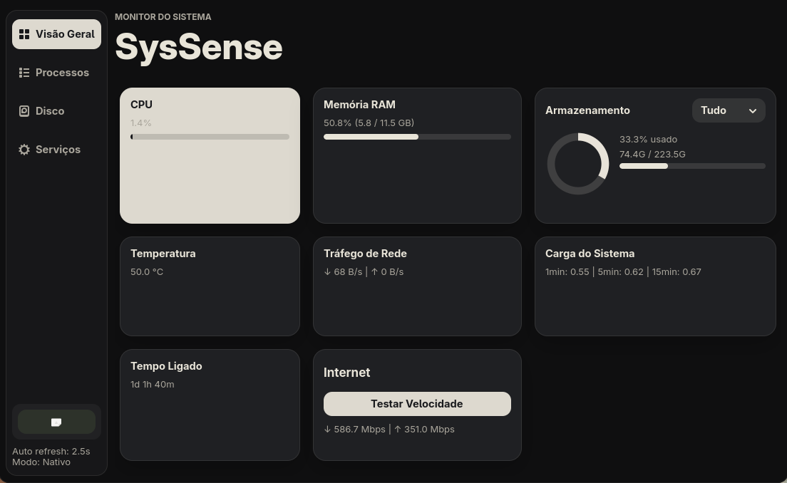

# SysSense

SysSense é um monitor de sistema para Fedora/GNOME feito em Python com GTK 4 e libadwaita.

O foco atual é oferecer uma dashboard simples, bonita e local para acompanhar CPU, memória, armazenamento, processos, rede em tempo real, temperatura, uptime, serviços systemd, alertas automáticos e teste de internet.



## Status

Versão atual: `0.4.0`

Modos oficiais:

- **Nativo local**: modo principal e recomendado para monitoramento completo do Fedora.
- **Flatpak sandbox**: modo experimental para teste isolado, aceitando limitações em processos, serviços e logs.

## Funcionalidades

- Dashboard em cards com CPU, RAM, armazenamento, temperatura, velocidade de rede, carga do sistema, uptime e internet.
- Gráfico de armazenamento com seleção de partição ou visão geral.
- Processos por memória, por CPU e comparação responsiva.
- Aba de disco com partições montadas e alertas de uso.
- Aba de serviços systemd com falhas e logs recentes.
- Alertas automáticos baseados em regras, com indicador na sidebar, painel interno e mensagens curtas nos cards afetados.
- Teste de velocidade sob demanda.
- Alertas visuais discretos para uso crítico de memória e armazenamento elevado.
- Painel interno de preferências para intervalo de atualização, toasts críticos e cards visíveis.
- Menu discreto na Visão Geral para reorganizar a ordem dos cards.
- Interface escura com GTK 4 + libadwaita.
- Atualização automática configurável das métricas principais.
- Transições leves entre seções, guias de processos e mensagens de alerta.

## Alertas automáticos

O SysSense avalia regras locais a cada atualização e mostra avisos sem exigir uma aba manual de diagnóstico.

| Área | Atenção | Crítico |
|------|---------|---------|
| Memória RAM | acima de 70% | acima de 85% |
| Armazenamento | acima de 70% na maior partição | acima de 90% na maior partição |
| CPU | acima de 80% | não há nível crítico na v0.3 |
| Swap | acima de 50% | não há nível crítico na v0.3 |
| Serviços | qualquer serviço systemd com falha | não há nível crítico na v0.3 |

Quando um alerta está ativo, o indicador da sidebar muda de estado, o painel interno de status lista os itens detectados e os cards afetados recebem uma borda e uma mensagem curta.

## Preferências

As preferências ficam em:

```text
~/.config/syssense/config.json
```

O arquivo é criado automaticamente quando uma preferência é alterada. Se ele estiver ausente ou inválido, o SysSense volta aos padrões seguros.

Preferências disponíveis:

- intervalo de atualização: `1s`, `2.5s`, `5s` ou `10s`;
- exibir ou ocultar toasts de alertas críticos;
- escolher quais cards aparecem na dashboard, incluindo o teste de internet.

A ordem dos cards é ajustada pelo menu de organização no canto superior direito da Visão Geral e também fica salva em `config.json`.

Os painéis de status e preferências abrem dentro da própria janela do app, sem popups externos do sistema.

## Instalação

Antes de instalar, escolha o modo de execução:

| Modo | Quando usar | O que esperar |
|------|-------------|---------------|
| **Nativo local** | Melhor opção para uso diário como monitor de sistema. | Mostra processos e métricas reais do Fedora, rodando como usuário normal. |
| **Flatpak sandbox** | Melhor opção para validar o app isolado. | O app fica isolado; processos, serviços e logs podem refletir apenas o sandbox. |

Os dois modos são somente leitura: o SysSense não altera configurações, não encerra processos e não controla serviços.

### Opção recomendada: nativo local

Use este modo se você quer que o SysSense funcione como um monitor real do seu Fedora. Esta é a instalação indicada para usuários finais.

1. Instale os pacotes GTK/libadwaita do Fedora:

   ```bash
   sudo dnf install python3-gobject gtk4 libadwaita
   ```

2. Clone o repositório e entre na pasta:

   ```bash
   git clone https://github.com/Marcos-VOC/SysSense.git
   cd SysSense
   ```

3. Instale no usuário atual:

   ```bash
   ./packaging/native/install.sh
   ```

4. Abra pelo menu de aplicativos procurando por `SysSense`, ou rode:

   ```bash
   syssense
   ```

O instalador cria:

- comando: `~/.local/bin/syssense`;
- atalho: `~/.local/share/applications/br.com.syssense.desktop`;
- ícone: `~/.local/share/icons/hicolor/scalable/apps/br.com.syssense.svg`.

Para atualizar uma instalação nativa, entre na pasta do projeto atualizada e rode novamente:

```bash
./packaging/native/install.sh
```

Para remover:

```bash
./packaging/native/uninstall.sh
```

### Opção experimental: Flatpak sandbox

Use este modo se você quer testar o app isolado. Por causa do sandbox, a aba de processos pode mostrar apenas processos internos do Flatpak, como `syssense` e `bwrap`. Para monitoramento completo do host, use a instalação nativa local.

1. Instale as ferramentas:

   ```bash
   sudo dnf install flatpak flatpak-builder
   flatpak remote-add --if-not-exists flathub https://flathub.org/repo/flathub.flatpakrepo
   flatpak install flathub org.gnome.Platform//50 org.gnome.Sdk//50
   ```

2. Clone o repositório e entre no manifest:

   ```bash
   git clone https://github.com/Marcos-VOC/SysSense.git
   cd SysSense/packaging/flatpak
   ```

3. Construa:

   ```bash
   flatpak-builder --force-clean ../../flatpak-build br.com.syssense.yml
   ```

4. Rode sem instalar:

   ```bash
   flatpak-builder --run ../../flatpak-build br.com.syssense.yml syssense
   ```

5. Opcionalmente, instale no usuário atual:

   ```bash
   flatpak-builder --user --install --force-clean ../../flatpak-build br.com.syssense.yml
   flatpak run br.com.syssense
   ```

Para remover a instalação Flatpak local:

```bash
flatpak uninstall --user br.com.syssense
```

## Rodar em desenvolvimento

Use este modo se você está editando o código localmente:

```bash
python3 -m pip install -r requirements.txt
./run.sh
```

Ou diretamente:

```bash
PYTHONPATH=src /usr/bin/python3 -m syssense.main
```

## Estrutura do projeto

```text
SysSense/
├── data/
│   ├── applications/       # .desktop canônico
│   ├── icons/              # ícone hicolor
│   └── metainfo/           # metadados AppStream
├── docs/
│   ├── flatpak-spike.md
│   ├── native-install.md
│   ├── release-checklist.md
│   ├── release-v0.1.md
│   ├── release-v0.2.md
│   ├── release-v0.3.md
│   ├── release-v0.4.md
│   ├── roadmap-v0.3.md
│   ├── roadmap-v0.4.md
│   ├── restructure-roadmap.md
│   └── testing.md
├── packaging/
│   ├── flatpak/            # manifest Flatpak
│   └── native/             # instalação local sem root
├── src/
│   └── syssense/
│       ├── collectors.py   # coleta de métricas
│       ├── config.py       # preferências locais persistentes
│       ├── diagnostics.py  # regras dos alertas automáticos
│       ├── formatters.py   # formatação de textos e unidades
│       ├── main.py         # Adw.Application
│       ├── resources/
│       │   └── styles.css  # estilos GTK do aplicativo
│       ├── ui/
│       │   ├── disk.py         # tela de disco
│       │   ├── overview.py     # dashboard e cards principais
│       │   ├── preferences.py  # painel interno de preferências
│       │   ├── processes.py    # tela de processos
│       │   ├── services.py     # tela de serviços
│       │   └── sidebar.py      # barra lateral
│       └── window.py       # janela principal e coordenação da UI
├── CHANGELOG.md
├── pyproject.toml
├── requirements.txt
└── run.sh
```

## Validação

```bash
python3 -m compileall src/syssense
python3 -m unittest
python3 -m pip install --no-deps --target /tmp/syssense-install-test .
desktop-file-validate data/applications/br.com.syssense.desktop
appstreamcli validate --no-net data/metainfo/br.com.syssense.metainfo.xml
bash -n packaging/native/install.sh packaging/native/uninstall.sh
```

Depois de testar o empacotamento local, remova artefatos temporários:

```bash
rm -rf /tmp/syssense-install-test build src/syssense.egg-info
find . -type d -name __pycache__ -prune -exec rm -rf {} +
```

## Segurança e privacidade

SysSense é somente leitura. Ele não altera configurações do sistema, não encerra processos, não controla serviços e não possui telemetria.

A única ação de rede intencional é o teste de velocidade, iniciado manualmente pelo usuário. Detalhes estão em `SECURITY.md` e `PRIVACY.md`.

## Roadmap

- `v0.1.0`: primeira versão pública com instalação nativa local e manifest Flatpak.
- `v0.2.0`: alertas visuais, rede em tempo real, diagnóstico automático e UX melhor nas abas técnicas.
- `v0.2.1`: painel de status, testes leves, documentação revisada e estabilização para publicação no GitHub.
- `v0.3.x`: instalação nativa refinada, testes ampliados, monitoramento mais claro, preferências locais e personalização dos cards.
- `v0.4.x`: reestruturação interna da interface em módulos menores, documentada em `docs/roadmap-v0.4.md` e `docs/restructure-roadmap.md`.

## Licença

MIT. Veja `LICENSE`.
